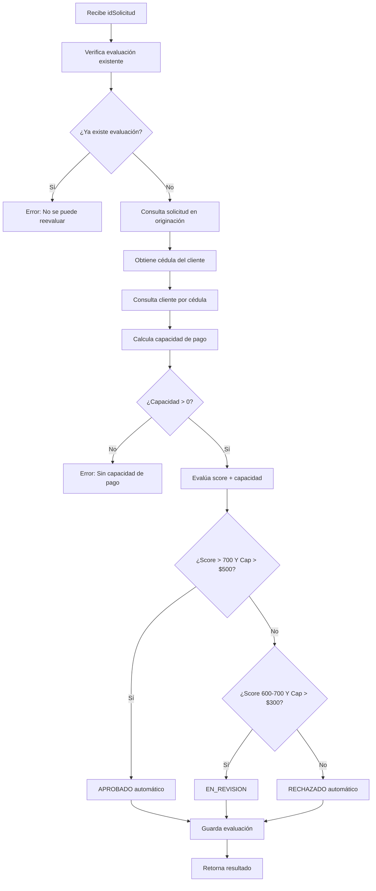

# Motor de Análisis Crediticio Automotriz

## Descripción

Microservicio de evaluación automática de solicitudes de crédito automotriz que integra con el sistema de originación para obtener datos del cliente y aplicar reglas de negocio bancarias para minimizar el riesgo crediticio.

## Arquitectura

El proyecto sigue una arquitectura de microservicios con Spring Boot, implementando los siguientes módulos funcionales:

### 🔄 Módulo 1: Integración con Originación
- Consumo de datos de solicitud desde el microservicio de originación
- Obtención de información del cliente (score interno, ingresos, egresos)
- Manejo de errores de conectividad y datos faltantes

### 📊 Módulo 2: Cálculo de Capacidad de Pago
- Cálculo automático: Capacidad de Pago = Ingresos - Egresos
- Validación de capacidad de pago positiva
- Almacenamiento en consulta de buró para trazabilidad

### ⚙️ Módulo 3: Evaluación Automática
- Aplicación de reglas de negocio basadas en score interno y capacidad de pago:
  - **Score > 700 Y Capacidad > $500**: Aprobado automático (Riesgo Bajo)
  - **Score 600-700 Y Capacidad > $300**: Revisión manual (Riesgo Medio)
  - **Score < 600 O Capacidad insuficiente**: Rechazado automático (Riesgo Alto)
- Almacenamiento de resultados y observaciones detalladas

### 👤 Módulo 4: Revisión del Analista
- Modificación manual de decisiones automáticas
- Justificación obligatoria de cambios
- Trazabilidad completa de decisiones

## Tecnologías Utilizadas

- **Java 17**
- **Spring Boot 3.5.3**
- **Spring Data JPA**
- **Spring Cloud OpenFeign**
- **PostgreSQL** (producción) / **H2** (desarrollo)
- **Lombok**
- **MapStruct**
- **OpenAPI 3 (Swagger)**
- **SLF4J** para logging

## Estructura del Proyecto

```
src/main/java/com/banquito/analisis/
├── controller/
│   ├── dto/                    # DTOs de respuesta
│   ├── mapper/                 # Mappers MapStruct
│   └── CreditAnalysisController # Controlador REST
├── exception/                  # Excepciones personalizadas
├── model/                      # Entidades JPA
├── repository/                 # Repositorios JPA
├── service/                    # Lógica de negocio
├── client/                     # Cliente Feign para originación
│   └── dto/                   # DTOs para integración
├── config/                     # Configuraciones (CORS, OpenAPI)
└── AnalisisApplication.java    # Clase principal
```

## Endpoints de la API

### Evaluación Crediticia

| Método | Endpoint | Descripción |
|--------|----------|-------------|
| POST | `/api/v1/credit-analysis/{idSolicitud}/evaluate` | Ejecutar evaluación automática |
| PATCH | `/api/v1/credit-analysis/{idSolicitud}/analyst-review` | Revisión del analista |
| GET | `/api/v1/credit-analysis` | Listar todas las evaluaciones |
| GET | `/api/v1/credit-analysis/{idSolicitud}` | Consultar evaluación específica |

### Documentación API
- **Swagger UI**: http://localhost:8080/swagger-ui.html

## Configuración

### Propiedades Principales

```properties
# Base de datos
spring.datasource.url=jdbc:postgresql://localhost:5432/analisis_crediticio
spring.jpa.hibernate.ddl-auto=update

# Servicio de Originación
originacion.url=http://ec2-3-15-235-240.us-east-2.compute.amazonaws.com:8081

# OpenAPI
springdoc.swagger-ui.path=/swagger-ui.html
```

### Perfiles de Ejecución

- **default**: Conexión real con originación
- **demo**: Usa mocks para pruebas sin integración externa

## Instalación y Ejecución

### Prerrequisitos
- Java 17 o superior
- Maven 3.6+
- PostgreSQL (para producción)

### Pasos de Instalación

1. **Clonar el repositorio**
   ```bash
   git clone <repository-url>
   cd AnalisisCredito
   ```

2. **Compilar el proyecto**
   ```bash
   mvn clean compile
   ```

3. **Ejecutar la aplicación**
   ```bash
   # Con perfil demo (mocks)
   mvn spring-boot:run "-Dspring-boot.run.profiles=demo"
   
   # Con integración real
   mvn spring-boot:run
   ```

4. **Acceder a la documentación**
   - Swagger UI: http://localhost:8080/swagger-ui.html

## Reglas de Negocio

### Capacidad de Pago
- **Fórmula**: Capacidad de Pago = Ingresos - Egresos
- **Validación**: Debe ser positiva para continuar evaluación
- **Umbrales**:
  - > $500: Aprobado automático
  - $300-$500: Revisión manual
  - < $300: Rechazado automático

### Evaluación por Score Interno
- **Score > 700**: Aprobado automático (Riesgo Bajo)
- **Score 600-700**: Revisión manual (Riesgo Medio)
- **Score < 600**: Rechazado automático (Riesgo Alto)

### Estados de Evaluación
- `APROBADO`: Evaluación aprobada automáticamente
- `RECHAZADO`: Evaluación rechazada automáticamente
- `EN_REVISION`: Requiere revisión manual del analista

### Categorías de Riesgo
- `BAJO`: Score alto y capacidad de pago adecuada
- `MEDIO`: Score medio o capacidad de pago moderada
- `ALTO`: Score bajo o capacidad de pago insuficiente

## Integración con Servicios Externos

### Microservicio de Originación
- **URL**: http://ec2-3-15-235-240.us-east-2.compute.amazonaws.com:8081
- **Endpoints consumidos**:
  - `GET /api/v1/solicitudes/{idSolicitud}`: Obtener datos de solicitud
  - `GET /api/v1/clientes/{cedula}`: Obtener datos del cliente
- **Datos obtenidos**:
  - Score interno del cliente
  - Ingresos mensuales
  - Egresos mensuales
  - Estado de la solicitud

### Manejo de Errores
- **Solicitud no encontrada**: Error 404
- **Cliente no encontrado**: Error 404
- **Datos faltantes**: Error 400 con mensaje descriptivo
- **Evaluación duplicada**: Error 400 (no se permite reevaluación)
- **Error de conectividad**: Error 502

## Flujo de Evaluación



## Ejemplo de Respuesta

```json
{
  "idSolicitud": 1,
  "estado": "APROBADO",
  "capacidadPago": 800.00,
  "nivelRiesgo": "BAJO",
  "decisionAutomatica": "APROBADO",
  "observaciones": "Score interno alto (750) y capacidad de pago adecuada (800): aprobado automático",
  "justificacionAnalista": "Score interno alto (750) y capacidad de pago adecuada (800): aprobado automático"
}
```

## Desarrollo y Pruebas

### Perfil Demo
Para desarrollo sin dependencias externas, usar el perfil `demo`:
```bash
mvn spring-boot:run "-Dspring-boot.run.profiles=demo"
```

Este perfil:
- Usa mocks en lugar de FeignClient real
- Simula datos de solicitud y cliente
- Permite pruebas sin conexión a originación

### Estructura de Base de Datos
- **evaluacion_crediticia**: Almacena resultados de evaluación
- **consultas_buro**: Almacena capacidad de pago y datos de buró
- **observacion_analista**: Almacena revisiones manuales

## Contribución

1. Fork el proyecto
2. Crea una rama para tu feature (`git checkout -b feature/AmazingFeature`)
3. Commit tus cambios (`git commit -m 'Add some AmazingFeature'`)
4. Push a la rama (`git push origin feature/AmazingFeature`)
5. Abre un Pull Request

## Licencia

Este proyecto está bajo la Licencia MIT - ver el archivo [LICENSE.md](LICENSE.md) para detalles.


